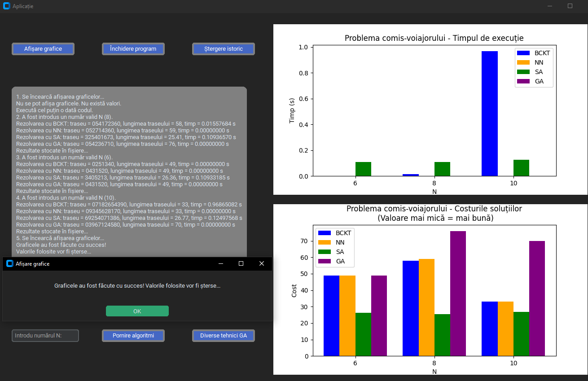
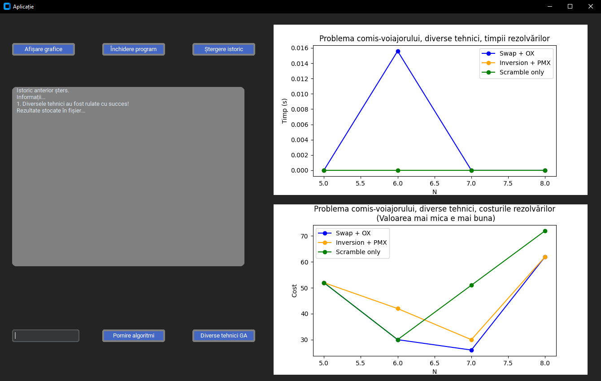
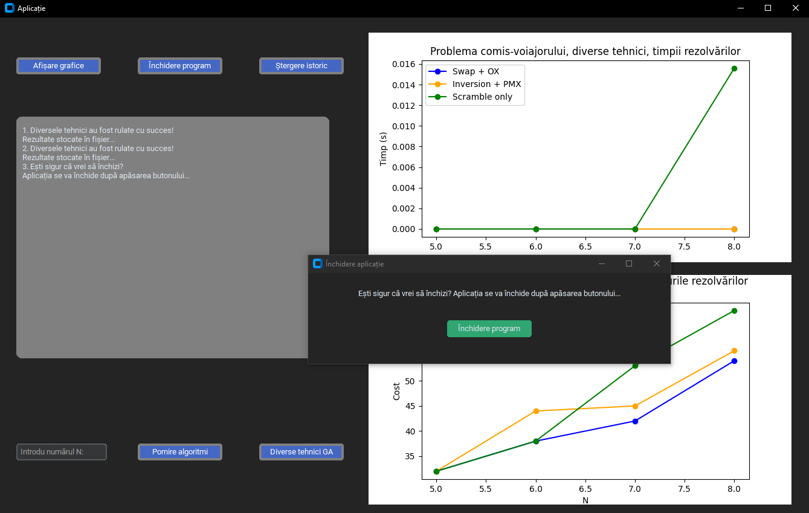

# Aplicație Algoritmi Evolutivi - Problema Comis-Voiajorului (TSP)

Această aplicație oferă o interfață grafică pentru testarea și compararea mai multor algoritmi de rezolvare a problemei comis-voiajorului (TSP), folosind tehnici evolutive și euristice. Codul este structurat modular, cu funcții separate pentru fiecare algoritm și pentru interacțiunea cu interfața grafică.

## Algoritmi implementați

- **Backtracking (BCKT)** – Căutare exhaustivă pentru soluția optimă;
- **Nearest Neighbor (NN)** – Algoritm euristic rapid, pornește dintr-un oraș și alege mereu cel mai apropiat oraș nevizitat;
- **Simulated Annealing (SA)** – Algoritm probabilistic inspirat din procesul de răcire a metalelor;
- **Genetic Algorithm (GA)** – Algoritm evolutiv ce folosește mutații și recombinări pentru a găsi soluții bune;
- **Diverse tehnici GA** – Testare cu diferite tipuri de mutații (swap, inversion, scramble) și recombinări (Order Crossover, PMX).

## Funcționalități

- **Interfață grafică** realizată cu [CustomTkinter](https://github.com/TomSchimansky/CustomTkinter);
- **Afișare grafice** comparative pentru timpii de execuție și costurile soluțiilor;
- **Salvare rezultate** în fișiere CSV pentru analiză ulterioară;
- **Istoric acțiuni** și posibilitate de ștergere a acestuia;
- **Pop-up-uri informative** pentru fiecare acțiune importantă.

## Cum se folosește

1. **Instalează dependențele**:
    ```bash
    pip install customtkinter matplotlib
    ```
2. **Rulează aplicația**:
    ```bash
    python main.py
    ```
3. **Introdu numărul de orașe (N)** și apasă `Pornire algoritmi` pentru a rula toți algoritmii.
4. **Folosește butoanele** pentru a afișa graficele, a testa diverse tehnici GA sau a șterge istoricul.

## Structura fișierelor rezultate

- `rezultat_tsp.csv` – Rezultate pentru fiecare rulare a algoritmilor TSP.
- `rezultat_diverse_tehnici_tsp.csv` – Rezultate pentru testarea tehnicilor GA.

## Exemplu interfață





## Cerințe

- Python 3.8+
- CustomTkinter
- Matplotlib

## Autori

- Andrei Bujor

## Licență

Acest proiect este distribuit sub licența MIT.
